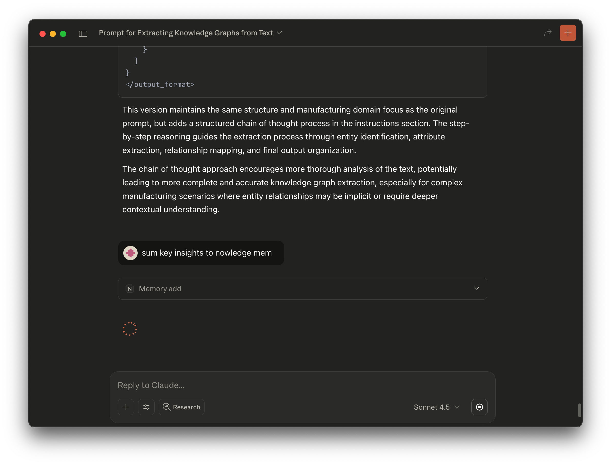

# Nowledge Mem Claude Desktop Extension

## Demo Screenshots




## End User Installation

1. Install Python 3.13

```bash
brew install python@3.13
```

1. Download Nowledge Mem Claude Desktop Extension and double click to install.


## Build the MCP bundle

> [!NOTE]
>
> Python 3.13 is required due to CPython Bug on leveraging dependencies in lib folder.

```bash
brew install python@3.13

python3.13 -m pip install -r requirements.txt -U --target server/lib

npx @anthropic-ai/mcpb pack
```
